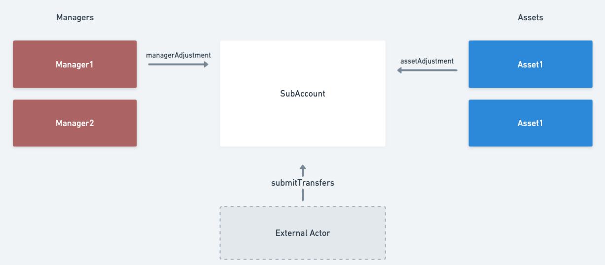

# Account

The Account contract is a permissionless ERC721 contract that can be used by any protocol to (1) handle accounting of asset balances (2) access control (3) enforce proper `Asset` and `Manager` interactions whenever balance adjustments are made.

There are two at least interfaces you need to implement to comply with `Account.sol`: `IAsset` and `IManager`.

## Accounting

Each account can hold a balance per `Assets` / `subId` pair, where `subId` is an identifier that is used to distinguish different asset sub-types that are codified by the same asset contract (e.g. $1500 Jan 1st ETH Call vs $1600 Jan 1st ETH Call). 

The base layer also tracks `{ asset, subId }`'s with non-zero balances in a `heldAssets` array per account. The actual balances are stored as `BalanceAndOrder` structs in a mapping, and we use the `.order` field to store the index of the `{ asset / subId }` in the `heldAssets` array to gas efficiently remove assets from the `heldAsset` array when the balance returns to 0.

## Access Control

Each asset can set unique approval requirements depending on whether the balance is **increasing** or **decreasing**. When an asset is transferred, each asset determines if this balance change needs an "allowance". For example, an **increasing** USD balance would not require allowance while a **decreasing** balance would. As a counter, if the asset is a perpetual, both **decreasing** and **increasing** adjustments would require an allowance as a positive perp balance could have a funding rate.

You can think of the access control as a 2 layer approve system:

### First Layer: **ERC721 approval**:

Same as any ERC721 based contract, the owner or ERC821 approved address is authorized to do anything on the user's behalf. We also grant irrevocable approval by default to the **manager** of the account.

### Second Layer: Custom approval

If `msg.sender` is not the owner or ERC721 approved, they will need **custom approval** to spend the account's balance. You can specify the spender to only increase or decrease the balance on a certain asset (or subId).

The logic for custom approvals is defined in `Allowance.sol`.

## Trasnsfer Hooks

There are three different flows that could update an account's balance. Each flow has a unique structure for how the `Asset` and `Manager` must be engaged in order for the flow to succeed.

### 1. Symmetric transactions

Transfers that subtract amount `x` from one account and add amount `x` to another account can be initiated by anyone using `Account.submitTransfers`. During the transfer, `Account.sol` passes information (the caller, old balance, transfer amount, etc) to the **Asset** through `IAsset.handleAdjustment`. In return, the asset returns the final balance and access requirements. This is called the `asset hook`.

`Account.sol` also passess relevant information (the caller, accountId) to the **Manager** through `IManager.handleAdjustment` to determine if the final state of the account is valid. This is called the `manager hook`

### 2. Adjustments initiated by managers

Adjustments initiated by the manager bypass the `manager hook`, but still go through `IAsset.handleAdjustment`. These transactions are initiated through `Account.managerAdjustment`. As an example, managers could use this functionality to transfer cash between accounts upon option settlement. 

*note: managers can also update the balance through `submitTransfers`, but it will trigger itself with `IManager.handleAdjustment` at the end.

### 3. Adjustments initiated by assets

An asset can choose choose to go through its own `asset hook` during a self triggered adjustment via `Account.assetAdjustment` (eg `handleAdjustment` can be handy to update interest rate accruals, so routing everything through the hook might not be a bad idea), but all transfers must still go through `IManager.handleAdjustment` at the end of the transaction.

One key feature that this enables is deposits and withdrawals of ETH or USD to form wrapped representations of these assets in the account layer.  